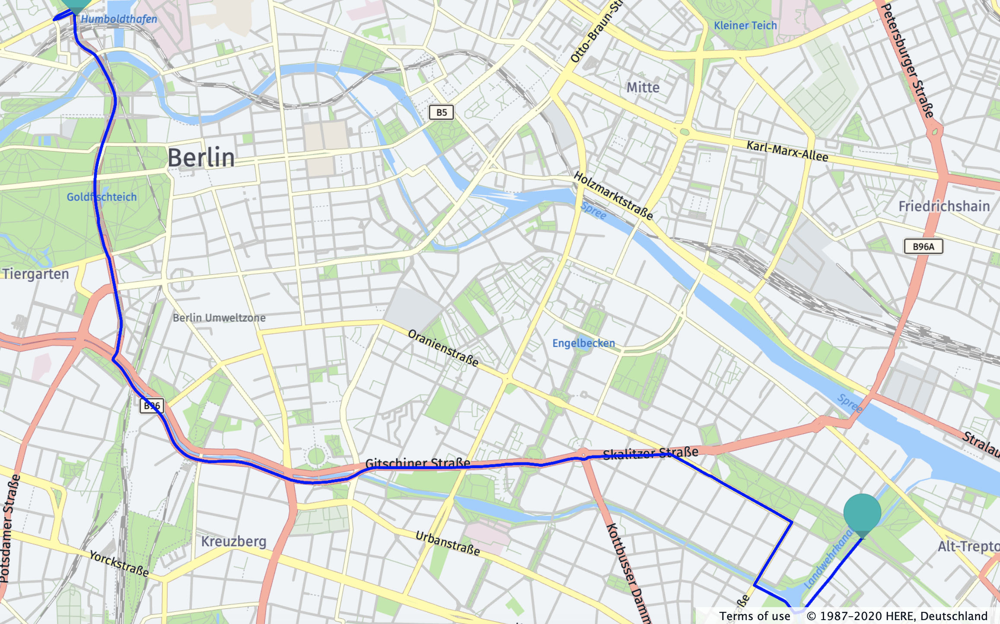
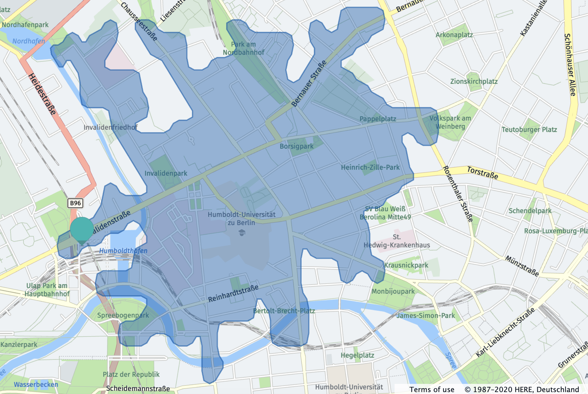
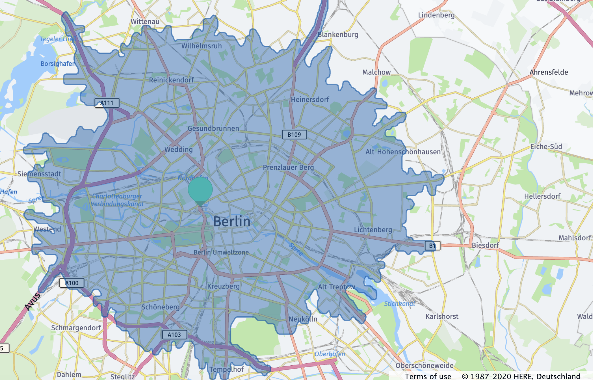
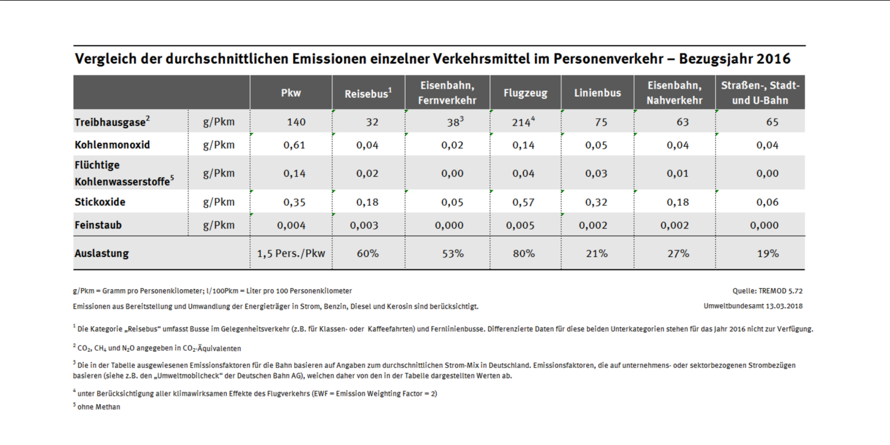

# Setup
The API key has been removed for legal reasons. You can run the project yourself with your own HERE API key, replacing the empty string value of `api_key` in `home.py`

## Contents

The project implements several HERE features

### Routing

### Isoling
This could be an example for an isolating map when using a car with a fixed amount of carbon to emit.

This could be an example for an isolating map when using a transit and a bicycle with a fixed amount of carbon to emit.

### Intermodal Routing

### Time and Emissions for intermodal routes

See `python_logic.py` for functions to compute overall time or emissions.

`compute_emissions()` together with a distance restriction can be used, to generate a co2-fixed isolating map.

Emissions are based on this report:

